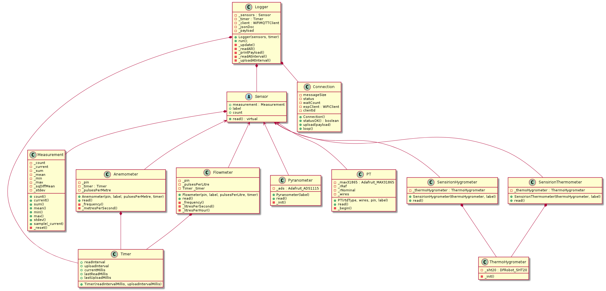

### Solar-logger

WiFi-based data logger for solar thermal collectors, developed on an ESP32 board.

### Sensors

* PT100 / PT1000 thermometer (using MAX31865)
* Pyranometer (using ADS1115)
* SHT20 Thermo-hygrometer
* Anemometer
* Flowmeter

| Physical quantity | Sensor           | Interface | Board    |
|-------------------|:----------------:|:---------:|:--------:|
| Temperature       | PT100/PT1000     | SPI       | MAX31865 |
| Irradiance        | Pyranometer      | I2C       | ADS1115  |
| RH                | SHT20            | I2C       | -        |
| Flow              | Pulse flowmeter  | -         | -        |
| Wind speed        | Pulse anemometer | -         | -        |


### Workflow

During each iteration of the ```loop()```, the ESP32 checks for connection status.

When the specified sampling interval has passed, all sensors are read and the measurement stats ```min, max, mean, stdev``` are calculated and stored in the ```Measurement``` object.

When the upload interval has passed, the ```JSON``` payload is updated with ```mean``` and ```stdev``` values. 

The ```Measurenent``` stats are reset and the payload is published to the MQTT broker.


### Configuration

Set the WiFi network and MQTT broker credentials in ```src/credentials.h```.

Configure the sampling and upload intervals as well as the sensors parameters (pins, labels etc) in the ```src/main.cpp```.

Thats all!

### Structure

To simplify the configuration process and avoid duplicate code, the project has been structured like this:



### Requirements

An MQTT broker is necessary to receive the payload and a really simple back end to insert the measurements to a database.

This project uses the [Logger-stack](https://github.com/orestispanago/Logger-stack), a dockerized Mosquitto+NodeRed+MySQL+Grafana server stack to receive, store and visualize measurements. 
